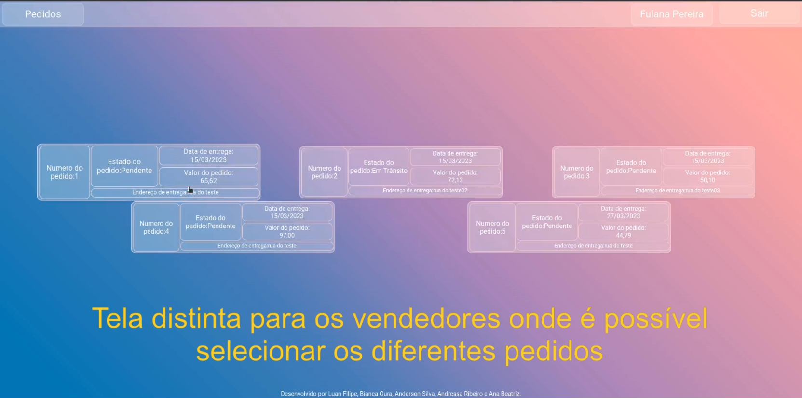

<!-- Introdução -->
<h1 align="center"> Projeto Delivery App - :two::eight: </h1>

<!-- Descrição -->
<p align="center">
Este é meu 28º projeto em minha jornada como desenvolvedor,
nele desenvolvi uma aplicação fullstack de uma loja de bebidas, com sistema de contas, paginas de vendas, 
carrinho de compras, página de pedidos, sistema de gerenciamento de vendas e sistema de gerenciamento de usuários.
O frontend foi desenvolvido em ReactJS e conta com multiplas rotas funcionais, já o backend foi construido com
NodeJS e express, seguindo a arquitetura MSC com o uso de um banco de dados SQL gerenciado via Sequelizer.
A construção do App seguiu o desenvolvimento orientado a testes(TDD), com testes unitários usando RTL para o frontend
e o uso do Mocha, Sinnon e Chai para o Backend.
</p>

#
<!-- Habilidades -->
<h2 align="center"> Habilidades Desenvolvidas: </h2>

* Utilizei _ReactJS_ para construir páginas WEB responsivas com rotas dinâmicas. :heavy_check_mark:
* Utilizei _React-Router-Dom_ para construir rotas diversase dar fluidez para a aplicação. :heavy_check_mark:
* Utilizei _Local Storage_ para armazenar dados de forma a garantir a permânencia da sessão de usuário. :heavy_check_mark:
* Utilizei _JWT_ para gerar tokens de validação para as sessões de usuário. :heavy_check_mark:
* Utilizei _CSS_ para adicionar estilo e posicionar elementos responsivos que se ajustam conforme a renderização dinâmica. :heavy_check_mark:
* Utilizei _NodeJS_ para gerir pacotes e scripts que permitem o funcionamento coeso do app. :heavy_check_mark:
* Utilizei _Express_ para construir um servidor arquitetádo conforme a metodologia MSC. :heavy_check_mark:
* Utilizei _Sequelizer_ para gerenciar o Banco de Dados SQL permitindo o manejo de usuários, compras e produtos cadastrados. :heavy_check_mark:
* Utilizei _hash md5_ para criptografar as senhas cadastradas dando mais segurança aos usuários. :heavy_check_mark:
* Utilizei _Axios_ para fazer a conexão e comunicação entre o front e backend. :heavy_check_mark:
* Utilizei _Testes Unitários_ para dar segurança à aplicação através do RTL, Mocha, Sinnon e Chai. :heavy_check_mark:
* Utilizei _Lint_ para organizar e dar coesão aos códgios da aplicação. :heavy_check_mark:
* Utilizei _Trello_ para orientar o Sprint de desenvolvimento através de um Kanban. :heavy_check_mark:
* Utilizei _Figma_ para orientar o desenvolvimento e dar coesão visual ás multiplas páginas. :heavy_check_mark:
* Utilizei _Gimp_ para criar uma Logo customizada. :heavy_check_mark:

#
<!-- Preview -->
<h2 align="center"> Preview: </h2>

<div align="center">
  <div style="text-align:center">
    
    
  </div>
</div>

<details align="center">
  <summary>
    <h2>Veja mais imagens do projeto:</h2>
  </summary>

<div align="center">
  <div style="text-align:center">
    
    
  </div>
  <div style="text-align:center">
    
    
  </div>
  <div style="text-align:center">
    
  </div>
</div>


</details>

#
<!-- Ferramentas utilizadas -->
<details align="center">
  <summary>
	  <h2>Ferramentas e Tecnologias utilizadas:</h2>
	</summary>

  <div align="center">

  | Linguagens            | Tecnologias           | Bibliotecas           | Frameworks            | Ferramentas           |
  | :-------------------- | :-------------------- | :-------------------- | :-------------------- | :-------------------- |
  | JavaScript            | CSS                   | ReactJS               | Chai                  | Figma                 |
  | SQL                   | ContextApi            | React Testing Library | Sinnon                | Trello                |
  | .                     | NPM                   | JsonWebToken          | Mocha                 | Gimp                  |
  | .                     | NodeJS                | Express-Async-Errors  | Express               | React Developer Tools |
  | .                     | Sequelizer            | md5                   | Axios                 | ThunderClient         |
  | .                     | Git                   | .                     | .                     | EsLint                |
  | .                     | ReactHooks            | .                     | .                     | StyleLint             |
  | .                     | React-Router          | .                     | .                     | .                     |
  | .                     | LocalStorage          | .                     | .                     | .                     |
  | .                     | MySql                 | .                     | .                     | .                     |

  </div>

</details>

#
<!-- Instalação e utilização -->
<details align="center">
  <summary>
    <h2>Como instalar e utilizar o projeto:</h2>
  </summary>

<details>
  <summary>
    <h3>Especificações Tecnicas:</h3>
  </summary>

  <div align="left">
  
  * Git - <i> `git -v` informará a versão em uso.</i>
  * NPM V8+ - <i> `npm -v` informará a versão em uso.</i>
  * NodeJS V16+ - <i> `node -v` informará a versão em uso.</i>
  * MySQL - <i> `node -v` informará a versão em uso.</i>
  > <b>NOTA:</b> Este projeto está otimizado para telas de pelo menos 1400x800, o uso em celulares ou tablets pode comprometer a integridade visual.

  </div>

  #

  </details>

  <div align="left">
    
  1. Faça a clonagem do projeto - <i>Descrição do comando em cinza</i>
  ```shell
  git clone git@github.com:luanfgoncalves/project-delivery-app.git
  ```
  2. instale as dependencias na Raiz do projeto - <i>Não é necessário utilizar `Audit Fix`</i>
  ```shell
  npm install
  ```
  3. Para utilizar a aplicação, execute na raiz do projeto: - <i>Utilizará as portas `3000` e `3001`.</i>
  ```shell
  npm run dev
  ```
  > <b>NOTA:</b> Antes da utilização é necessário popular o banco de dados através do comando: `npm run dev:prestart`
  4. Para utilizar apenas o frontend, execute no diretório de frontend: - <i>Será executado na porta `3000`.</i>
  ```shell
  npm start
  ``` 
  5. Para utilizar apenas o backend, execute no diretório de backend: - <i>Será executado na porta `3001`.</i>
  ```shell
  npm run dev
  ```
  6. Para encerrar a execução da aplicação: - <i>Deve ser executado no diretório onde o app foi iniciado.</i>
  ```shell
  npm stop
  ```
  7. Para rodar os testes da aplicação, execute na raiz do projeto: - <i>Os testes podem ser encontrados em ./front-end/tests</i>
  ```shell
  npm test
  ```
  8. Para visualização do banco de dados é recomendado o uso do MySQL workBench: - <i>O MySql é necessário para o funcionamento do app</i>
  ```
  https://www.mysql.com/products/workbench/
  ``` 
  > <b>NOTA:</b> Caso deseje restaurar o banco de dados você pode utilizar `npm run db:reset` na raiz do projeto.
  
  </div>

</details>

#
<!-- Meu contato -->
<h2 align="center"> Connect with me: </h2>

<div align="center">
  <a href="https://instagram.com/luanfgoncalves" target="_blank"></a>
  <a href = "mailto:luanfgoncalves@outlook.com"></a>
  <a href="https://www.linkedin.com/in/luanfgoncalves/" target="_blank"></a> 
</div>
